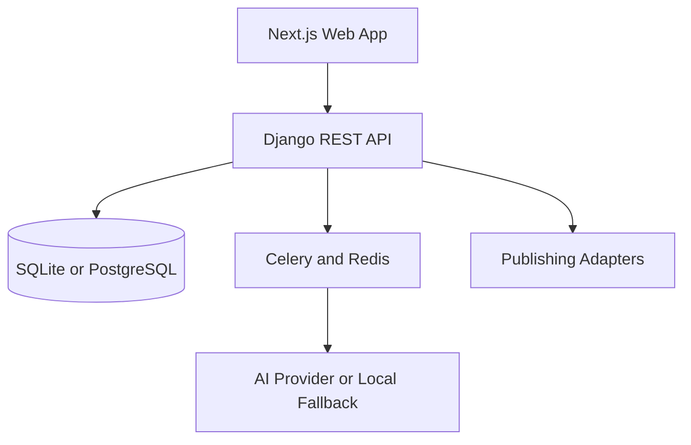

# Sabd Studio — CreatorFlow AI

> Turn one idea into a reviewable multi-platform content pipeline.

Sabd Studio is a full-stack creator-workflow automation project built for a hackathon. A creator can submit an idea or transcript, generate platform-specific assets, review and approve them, analyse SEO, plan a publishing calendar, and inspect analytics and recommendations from one dashboard.

## Why it exists

Creators repeatedly rewrite the same source material for every platform. Sabd Studio brings ingestion, repurposing, human review, SEO, scheduling, and performance feedback into one workflow.

## Features

- Email registration and JWT bearer authentication
- Workspaces, memberships, and brand-voice profiles
- Campaigns created from text, documents, media, or URLs
- Multi-stage processing with status tracking
- Assets for YouTube, Instagram, LinkedIn, X/Twitter, blogs, and shorts
- Asset editing, approval, regeneration, and version history
- Eight-check SEO scoring and thumbnail prompt studio
- Content calendar, scheduling, analytics, recommendations, and audit logs
- Provider-ready integrations and a deterministic local demo generator
- Google account sign-in with server-side ID-token verification
- Cloudinary media uploads and optional MongoDB event storage
- Media editor with local preview, trimming, aspect-ratio reframing, filters, caption overlays, mute/speed controls, and non-destructive render recipes
- Browser-native WebM rendering with live progress and download, plus optional Cloudinary persistence when a campaign is selected
- Grouped, collapsible dashboard navigation and a side-by-side editor with sticky bottom output controls
- AI Clip Studio for compliant YouTube embeds, transcript-aware highlight ranking, Shorts/Reel/Vlog presets, and Media Editor handoff for owned source files
- Integration Hub showing the exact Vercel variables required for AI, transcription, media, data, email, and social publishing providers
- OpenAPI/Swagger documentation and Docker configuration

## Architecture



## Technology stack

| Area | Technologies |
|---|---|
| Frontend | Next.js 14, React 18, TypeScript, Tailwind CSS, TanStack Query, Recharts |
| Backend | Python 3.12+, Django 5, Django REST Framework, Celery |
| Data | SQLite development fallback, PostgreSQL and Redis container definitions |
| Flexible events | MongoDB Atlas through PyMongo |
| Media storage | Cloudinary with a local-development fallback |
| AI and media | OpenAI/Gemini hooks, Pillow, pdfplumber, python-docx, ReportLab |
| Delivery | Docker and Docker Compose |

## Repository structure

```text
sabd-studio/
├── backend/          # Django REST API and domain apps
├── frontend/         # Next.js App Router interface
├── scripts/          # Local development helper
├── docker-compose.yml
├── .env.example
└── README.md
```

## Local setup

### Prerequisites

- Python 3.12+
- Node.js 20+
- npm
- Redis when running Celery-backed jobs
- Docker Desktop only for the container setup

### 1. Environment

From the repository root on Windows PowerShell:

```powershell
Copy-Item .env.example .env
```

Linux or macOS:

```bash
cp .env.example .env
```

The example contains placeholders. Never commit the populated `.env` file.

For Vercel, link the project and add values interactively (never paste secrets into Git):

```bash
npm install -g vercel
vercel login
vercel link
vercel env add CLOUDINARY_CLOUD_NAME production
vercel env add CLOUDINARY_API_KEY production
vercel env add CLOUDINARY_API_SECRET production
vercel env add MONGODB_URI production
vercel env add AI_API_KEY production
vercel env add GOOGLE_CLIENT_ID production
vercel env add NEXT_PUBLIC_GOOGLE_CLIENT_ID production
vercel env pull .env.local
```

The Integration Hub lists the remaining provider-specific variable names and offers a copy button. Add only the providers you intend to enable.

### 2. Backend

Windows PowerShell:

```powershell
cd backend
py -3.12 -m venv venv
.\venv\Scripts\Activate.ps1
pip install -r requirements.txt
python manage.py migrate
python manage.py seed_demo_data
python manage.py runserver 127.0.0.1:8000
```

Linux or macOS:

```bash
cd backend
python3 -m venv venv
source venv/bin/activate
pip install -r requirements.txt
python manage.py migrate
python manage.py seed_demo_data
python manage.py runserver 127.0.0.1:8000
```

- Backend: `http://127.0.0.1:8000`
- Swagger UI: `http://127.0.0.1:8000/api/docs/`

### 3. Frontend

Open a second terminal:

```bash
cd frontend
npm install
npm run dev
```

Frontend: `http://localhost:3000`

## Demo account

After running `python manage.py seed_demo_data`:

```text
Email: demo@creatorflow.ai
Password: password123
```

These credentials are for local demonstrations only. Do not enable this account unchanged in a public deployment.

## Verification

Backend:

```bash
cd backend
python manage.py check
python manage.py test apps.accounts apps.campaigns apps.seo
```

Frontend:

```bash
cd frontend
npm run build
```

## Docker

```bash
docker compose up --build
```

The Compose file defines frontend, backend, worker, PostgreSQL, and Redis services. Review and replace every placeholder before deploying outside a local environment.

## Two-minute demo flow

1. Seed the database and sign in with the demo account.
2. Review the stored audience and tone under Brand Voice.
3. Create a text campaign and select target platforms.
4. Launch the pipeline and observe its processing stages.
5. Review, edit, and approve an asset in Content Studio.
6. Inspect the asset's SEO score and thumbnail concepts.
7. Open Media Editor, upload a clip, preview a trim, and save its Cloudinary render recipe.
8. Schedule the approved asset on the calendar.
9. Export the campaign package.
10. Explain the feedback loop through Analytics and Recommendations.

## Security notes

- `.env`, virtual environments, build output, caches, media, and local databases are excluded from Git.
- Replace all example secrets before deployment.
- The frontend currently stores its bearer token in browser local storage. A hardened production version should use secure `HttpOnly`, `Secure`, `SameSite` cookies and refresh-token rotation.
- Validate workspace permissions for every new endpoint.
- Follow current provider terms, OAuth scopes, and rate limits before enabling publication.

## Current limitations

### Integration design

- The relational database remains the system of record for users, permissions, workspaces, campaigns, and schedules.
- MongoDB stores flexible upload and AI-generation event documents when `MONGODB_URI` is configured.
- Cloudinary stores media when all Cloudinary credentials are configured; local development falls back safely.
- Google Identity credentials are verified by Django against `GOOGLE_CLIENT_ID` before app tokens are issued.
- OpenAI or Gemini is selected through `AI_PROVIDER`; otherwise the labelled deterministic demo provider is used.

- External publishing and live analytics require approved platform credentials.
- The deterministic generator and sample analytics are demonstration fallbacks and must remain visibly labelled.
- PostgreSQL, Redis, Celery, cloud storage, HTTPS, monitoring, and backups require deployment-specific configuration and verification.
- Real transcription depends on a configured transcription provider.

## Project leadership

- **Chandan Kumar Rai** (`@chandan326`) — Creator and maintainer
- **Manshi Vinod** (`@manshivinodd`) — Contributor

## Contributing

Create a feature branch, keep secrets out of commits, add tests for changed behaviour, and verify both Django and Next.js before opening a pull request.

## License

Released under the [MIT License](LICENSE).
